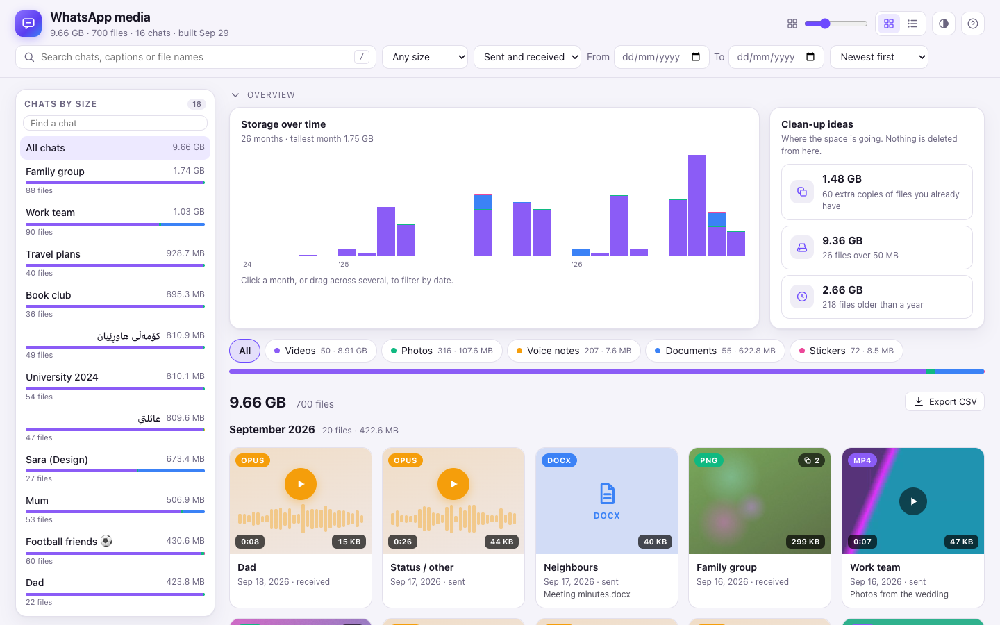
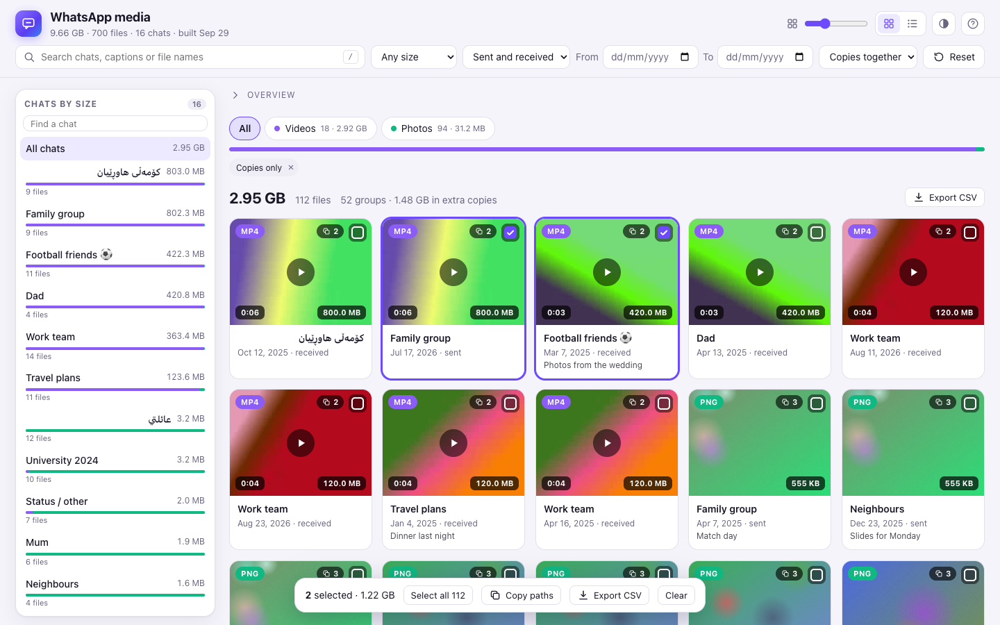
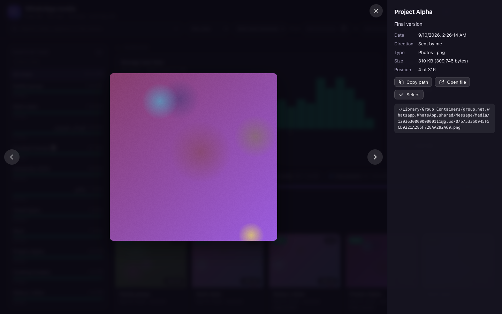
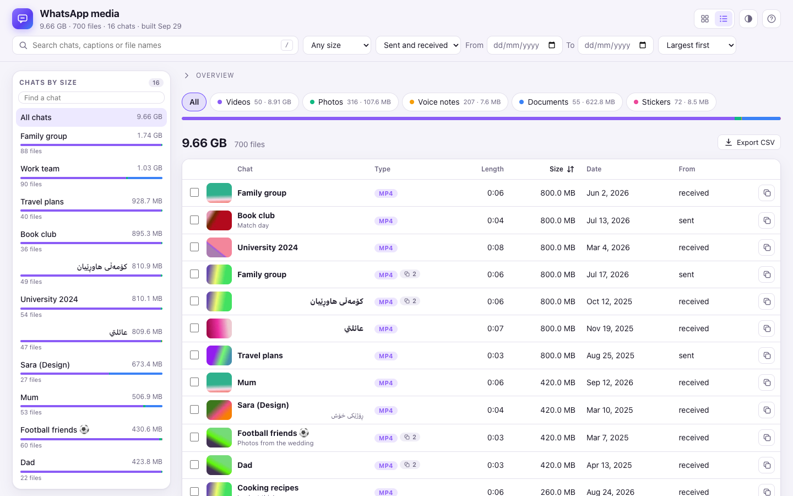
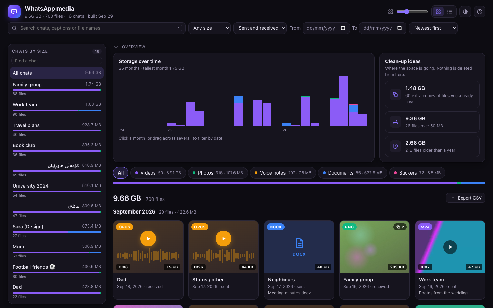

# WhatsApp Media Browser

See what is using the space in **WhatsApp for Mac**. This is a small local page that lists every photo, video, voice
note, document and sticker WhatsApp has downloaded to your Mac, so you can find the chats and files that take the
most room, preview them, and spot files you have several copies of.

Everything stays on your Mac. There is no server, no account and no network access: a Python script reads WhatsApp's
folder, and a single HTML page shows the result.



> The screenshots use an invented library (`tools/make_demo.py`), not real chats.
>
> Not affiliated with, endorsed by or connected to WhatsApp or Meta. "WhatsApp" is a trademark of its owner.

## What you can do

- **Find the big things.** Chats are listed by size, each with a bar showing what it is made of. Filter by type
  (videos, photos, voice notes, documents, stickers), size, date, and sent or received. Sort by size, date, length
  or chat.
- **See when the space went.** A chart of storage per month, split by type. Click a month, or drag across several, to
  look at just those months.
- **Find copies.** The same video forwarded into five chats is stored five times. *Clean-up ideas* counts the extra
  copies and shows them together; open a file to see every chat it is in.
- **Get quick answers.** One click for files over 50 MB, or files older than a year.
- **Search everything.** Chat names, photo and video captions, document names and file types, as you type.
- **Preview in place.** Photos, videos and voice notes open in a viewer with the details beside it (arrow keys to
  move on). Voice notes also play right in the grid, with a waveform.
- **Grid or list.** The list has sortable columns and a thumbnail; the grid has a size slider and, when sorted by date, month headings.
- **Select and export.** Tick files (shift-click for a range), then copy their paths or save a CSV of them, or of
  everything that matches your filters.
- **Pick up where you left off.** Filters, sort and view are kept in the page address; theme and card size are
  remembered. Light, dark or automatic.
- **Keyboard first.** Press `?` for the list.

|   |   |
|---|---|
|  |  |
|  |  |

## How it works

1. `build.py` walks WhatsApp's downloaded-media folder and reads chat names, message dates, captions and durations
   from WhatsApp's own database (`ChatStorage.sqlite`). It opens the database **read-only** and never changes
   anything in WhatsApp's folder.
2. It makes small preview images for photos, stickers and videos and writes them to `thumbs/` next to the script.
   Previews already made are kept, so running it again is quick.
3. It looks for copies: files that share a size are fingerprinted. A file up to 16 MB is read whole; a bigger one is
   identified by its size and four 1 MB samples of it (its start, two inner points and its end), which is almost
   certainly enough to tell two videos apart. Fingerprints are kept in `hashes.json`, so only new files are read.
4. It writes `data.js`, the list the page reads.
5. `index.html` shows that list. Open it in your browser.

## Use it

Requirements: macOS with WhatsApp for Mac installed, and Python 3 (nothing to `pip install`). Photos and stickers are
previewed with the `sips` tool that ships with macOS. Video previews need [ffmpeg](https://ffmpeg.org)
(`brew install ffmpeg`); without it, videos show an icon instead of a picture.

```sh
git clone https://github.com/AvrazAkraye/whatsapp-media-browser.git
cd whatsapp-media-browser
python3 build.py --open        # about a minute for tens of thousands of files
```

macOS may ask whether your terminal may access data from other apps, because WhatsApp's files live in its group
container (`~/Library/Group Containers/group.net.whatsapp.WhatsApp.shared`). Allow it, or run the script again after
granting your terminal access in System Settings → Privacy & Security.

Run `python3 build.py` again whenever you want to refresh the list.

Options:

| Option | What it does |
|---|---|
| `--open` | open the page in your browser when done |
| `--no-thumbs` | skip the preview images (much faster; the grid shows icons) |
| `--no-dupes` | skip looking for copies of the same file |
| `--jobs N` | parallel workers for previews and fingerprints (default 8) |
| `--container DIR` | another WhatsApp data folder (default: WhatsApp for Mac's) |
| `--out DIR` | where `data.js` and `thumbs/` go (default: next to the script; put `index.html` there too) |

### Keyboard shortcuts

| Key | |
|---|---|
| `/` | search |
| `v` | grid or list |
| `t` | theme: automatic, light, dark |
| `Esc` | close the viewer, clear the search, then clear the selection |
| `←` `→` | previous and next file in the viewer |
| `Space` | play or pause in the viewer |
| `s` `c` | select the file, copy its path (in the viewer) |
| `?` | this list |

### Browsers

Chrome, Edge and other Chromium browsers show every preview. Safari and Firefox may refuse to open files outside this
folder from a local page (and Safari may not play WhatsApp's `.opus` voice notes); the page says so and **Copy path**
still works, so you can open the file in Finder (⌘⇧G).

## Freeing space

The page only reads. To delete media, use WhatsApp itself (Settings → Storage and data → Manage storage) rather than
removing files from the folder, so WhatsApp's own records stay correct. *Clean-up ideas*, the size filters and the
CSV export are there to show you where to look.

## Privacy

`data.js`, `thumbs/` and `hashes.json` contain your chat names, captions, file names and picture previews. They are
listed in `.gitignore` so they are never committed. **Do not publish them, and do not share screenshots of the page
without hiding the chat names.** The page never connects to anything; you can check with your browser's network tab.

## Try it without your chats

```sh
python3 tools/make_demo.py      # invents a WhatsApp folder in demo/ and builds the page from it
open demo/site/index.html
```

The demo's chats, people, captions and numbers are made up (`555-01xx` numbers are reserved for fiction). It uses
ffmpeg, if you have it, for the videos, stickers and voice notes; a few files are sparse, so they look large without
taking the space.

## Development

```sh
python3 -m unittest discover -s tests -v     # build.py against a tiny invented WhatsApp folder
```

The page is one file, `index.html`, with no build step and no dependencies. `build.py` uses only the standard library.

## Limits

- It shows only media that has been downloaded to this Mac, not what is still on your phone or in WhatsApp's cloud.
- Chat names come from WhatsApp's database; a chat with no saved name is shown by its number or a short id.
- A "copy" is a file with the same size and content fingerprint. For files over 16 MB that is a fingerprint of
  samples of the file, not of every byte.
- The interface is in English.
- macOS only, and only the WhatsApp for Mac app.

## License

[MIT](LICENSE).
